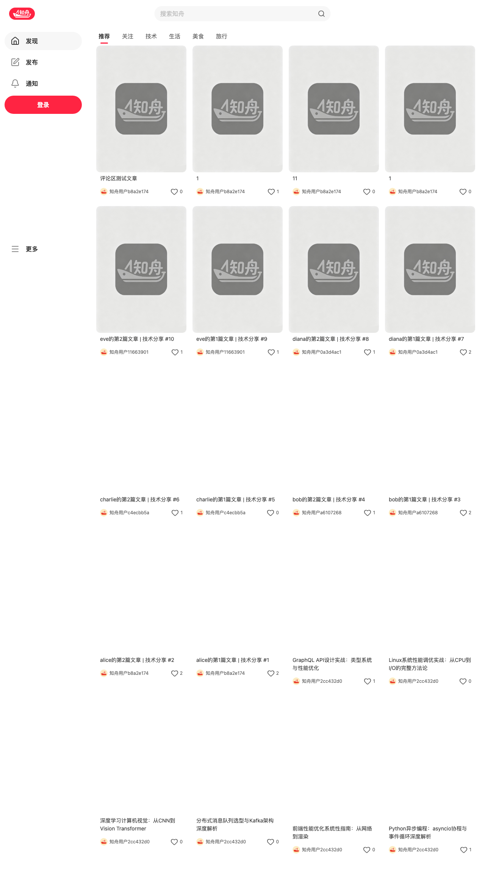
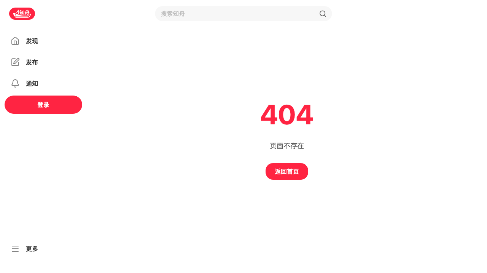
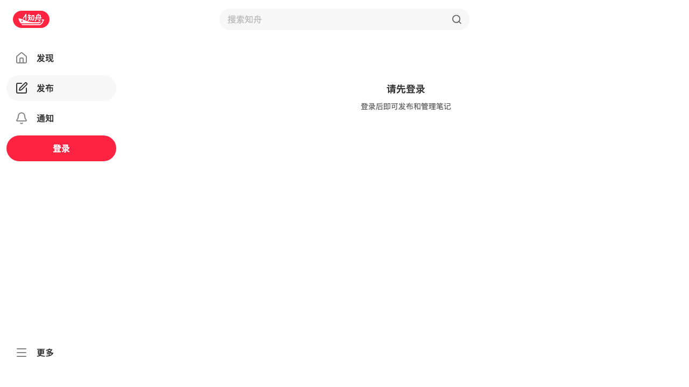
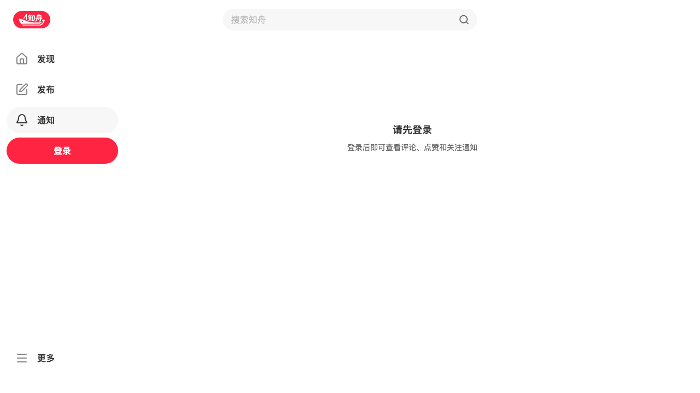
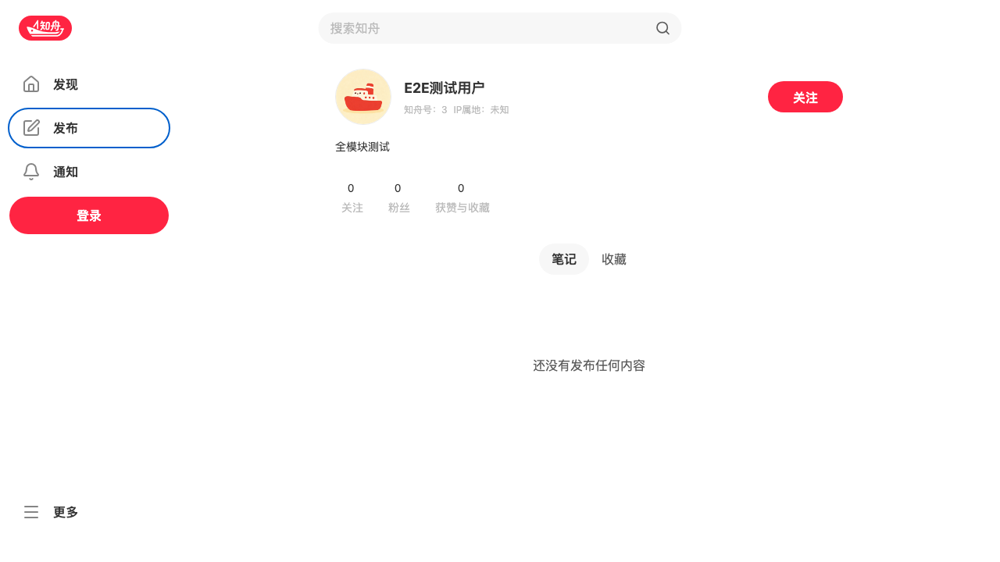
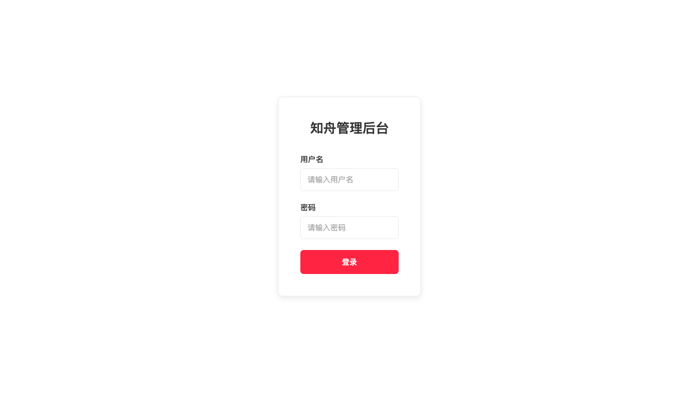

# 知舟 (Zhizhou) — 知识获取与分享社区

> 书山有路勤为径，学海无涯苦作舟

AI 驱动的知识获取与分享社区。前端基于 React 19 + TypeScript 构建，提供内容发布、社交互动、AI 搜索等功能。

🔗 **后端仓库**: [arknow_be](https://github.com/Tony12290427/arknow_be)

📐 **架构设计**: 后端 [ARCHITECTURE.md](https://github.com/Tony12290427/arknow_be/blob/main/ARCHITECTURE.md) — 搜索管线、高并发优化、系统架构

## 截图预览

| 主页 Feed | Explore 发现 | AI 搜索 |
|-----------|-------------|---------|
|  |  |  |

| 帖子详情 | 个人主页 | 发布页 |
|---------|---------|--------|
|  |  |  |

| 通知 | 暗黑模式 | 管理后台 |
|------|---------|---------|
|  |  |  |

## 功能演示

| Feed 浏览 & 瀑布流滚动 | 发布流程 |
|----------------------|---------|
|  |  |

## 技术栈

| 类别 | 技术 | 版本 | 用途 |
|------|------|------|------|
| 框架 | React | 19.2.5 | UI 框架 |
| 语言 | TypeScript | 6.0 | 类型安全 |
| 构建 | Vite | 8 | 构建工具 |
| 样式 | Tailwind CSS | 4.2 | 原子化 CSS |
| 路由 | React Router | 7.15 | 客户端路由 |
| 服务端状态 | TanStack React Query | 5.100 | 请求缓存 + 乐观更新 |
| 客户端状态 | Zustand | 5.0 | 轻量状态管理 |
| 表单 | React Hook Form + Zod | 7.75 + 4.4 | 表单 + 校验 |
| UI 组件 | Radix UI | — | 无障碍访问组件原语 |
| 动画 | Framer Motion | 12.38 | 动画系统 |
| HTTP | Axios | 1.16 | HTTP 客户端 |
| 图标 | Lucide React | 1.14 | 图标库 |
| 图片裁剪 | Cropper.js | 2.1 | 头像裁剪 |
| 表情 | emoji-picker-react | 4.19 | 表情选择器 |
| 不可变数据 | Immer | 11.1 | 不可变更新 |
| PWA | vite-plugin-pwa | — | 离线服务 |
| 国际化 | react-i18next | — | 中/英双语 |
| 错误监控 | Sentry | — | 错误追踪 + Web Vitals |
| Lint | ESLint + typescript-eslint | 10 | 代码检查 |

## 功能

- 知识帖文发布：草稿创建 → OSS 图片直传 → 内容确认 → 发布审核
- 内容互动：点赞、收藏、评论（带软删除 + @提及）
- 社交关注：关注/取消关注 + 互相关注三态查询 + 关注/粉丝列表
- AI 智能搜索：自然语言提问 → 混合检索（BM25 + 向量）→ DeepSeek 流式回答
- Feed 流：分页瀑布流，基于热度 + 时间的排序推荐
- 通知系统：点赞/评论/关注实时通知，进入页面自动已读
- 个人主页：用户资料卡、帖子/收藏/点赞列表
- 收藏集：创建/管理收藏集、帖子收藏
- 暗黑模式：全局主题切换，0.3s CSS 过渡
- PWA 离线支持：Service Worker + 应用清单
- 管理后台：用户管理、帖子审核、评论管理、关注管理、系统监控（17 个管理接口）
- 搜索历史：本地搜索历史记录（Zustand 持久化）
- 国际化：中/英双语完整翻译

## 目录结构

```
src/
├── assets/                    # 静态资源（图片、字体）
├── components/                # 共享组件
│   ├── admin/                 # 管理后台组件
│   ├── mention/               # @提及输入组件
│   ├── menu/                  # 菜单组件
│   ├── modals/                # 弹窗组件
│   ├── skeleton/              # 骨架屏（加载占位）
│   ├── spinner/               # 加载指示器
│   ├── ui/                    # 基础 UI 组件
│   ├── BackToTopButton.tsx    # 回到顶部按钮
│   ├── ConfirmDialog.tsx      # 确认弹窗（通用）
│   ├── ContentEditableInput.tsx # 富文本输入框
│   ├── ContentRenderer.tsx    # 内容渲染器（Markdown/富文本）
│   ├── CropModal.tsx          # 图片裁剪弹窗
│   ├── DetailCard.tsx         # 帖子详情卡片 🌟（最大最复杂的组件）
│   ├── DropdownSelect.tsx     # 下拉选择器
│   ├── EmojiPicker.tsx        # 表情选择器
│   ├── FollowButton.tsx       # 关注按钮（含 inFlight 锁 + store 信任逻辑）
│   ├── ImageViewer.tsx        # 图片查看器（全屏预览 + 滑动）
│   ├── LazyImage.tsx          # 懒加载图片（IntersectionObserver）
│   ├── LikeButton.tsx         # 点赞按钮
│   ├── MbtiPicker.tsx         # MBTI 选择器
│   ├── MultiImageUpload.tsx   # 多图上传
│   ├── PostItem.tsx           # 帖子列表项（Feed 流卡片）
│   ├── TabContainer.tsx       # 标签页容器
│   ├── TagSelector.tsx        # 标签选择器
│   ├── TextImageModal.tsx     # 图文混排弹窗
│   ├── Toast.tsx              # Toast 通知组件
│   ├── UserHoverCard.tsx      # 用户悬停卡片
│   ├── UserInfoCard.tsx       # 用户信息卡片
│   ├── VerifiedBadge.tsx      # 认证徽章
│   ├── VideoUpload.tsx        # 视频上传
│   └── WaterfallFlow.tsx      # 瀑布流布局容器
├── config/                    # 配置文件
├── hooks/                     # 自定义 Hooks
├── lib/api/                   # API 客户端（Axios 实例 + 拦截器）
│   ├── auth.ts                # 认证 API
│   ├── categories.ts          # 分类 API
│   ├── channel.ts             # 频道 API
│   ├── comment.ts             # 评论 API
│   ├── index.ts               # Axios 实例 + JWT 拦截器
│   ├── notification.ts        # 通知 API
│   ├── post.ts                # 帖文 API
│   ├── posts.ts               # 帖文列表 API
│   ├── tags.ts                # 标签 API
│   ├── upload.ts              # 文件上传 API
│   ├── user.ts                # 用户 API
│   └── video.ts               # 视频 API
├── pages/                     # 页面组件
│   ├── admin/                 # 管理后台
│   ├── draft-box/             # 草稿箱
│   ├── explore/               # 探索发现页
│   ├── layout/                # 布局组件（Sidebar + Header）
│   ├── notification/          # 通知页
│   ├── post-management/       # 帖子管理
│   ├── publish/               # 发布页
│   ├── search/                # AI 搜索页
│   ├── user/                  # 个人主页
│   ├── NotFound.tsx           # 404 页面
│   ├── PostDetail.tsx         # 帖子详情页
│   └── Publish.tsx            # 发布入口
├── stores/                    # Zustand 状态管理（19 个 store）
│   ├── auth-store.ts          # 认证状态
│   ├── follow-store.ts        # 关注状态 🌟（核心 — inFlight 锁 + toggle）
│   ├── like-store.ts          # 点赞状态
│   ├── collect-store.ts       # 收藏状态
│   ├── comment-store.ts       # 评论状态
│   ├── comment-like-store.ts  # 评论点赞
│   ├── notification-store.ts  # 通知状态
│   ├── theme-store.ts         # 暗黑模式
│   ├── user-store.ts          # 用户信息
│   ├── search-history-store.ts # 搜索历史
│   ├── navigation-store.ts    # 导航状态
│   ├── channel-store.ts       # 频道状态
│   ├── event-store.ts         # 事件总线
│   ├── keyboard-shortcuts-store.ts # 键盘快捷键
│   ├── about-store.ts         # 关于页面
│   ├── account-security-store.ts  # 账户安全
│   ├── admin-store.ts         # 管理后台状态
│   ├── change-password-store.ts   # 修改密码
│   └── verified-store.ts      # 认证状态
├── types/                     # TypeScript 类型定义
└── utils/                     # 工具函数
```

## 关键设计决策

### 关注按钮状态管理

**FollowButton 竞态修复**：
- `setUserInfo` 异步导致 `getFollowStatus` 读到旧 state，`userInfo.id` 为 `undefined` 直接 return
- **修复 1**：`getFollowStatusForUser(response)` 直接传参，不读 state
- **修复 2**：useEffect 只在 `!storeState.hasState` 时用 prop 初始化，store 有数据后信任 store
- **修复 3**：`inFlight` Set 锁防同一 userId 的并发 `toggleUserFollow`

**时序流**：
```
父组件 isFollowing=false(props) → FollowButton 挂载
  → useEffect: store 空 → initUserFollowState(key, false)
  → getFollowStatusForUser(userId) 异步返回 true
  → store 更新为 followed=true
  → 组件重渲染，useEffect：store 有数据 → 跳过覆盖
```

### 点赞/收藏

- `like-store.ts` 和 `collect-store.ts` 使用 `entityType: "knowpost"` 匹配后端 Redis bitmap key
- DetailCard 使用 `??` 替代 `||`：`0 || oldCount` 返回 `oldCount`，`0 ?? oldCount` 返回 `0`

### 评论软删除

- 父评论删除：子回复保留但前端隐藏
- 主帖删除：所有评论级联软删除
- 已删除评论渲染骨架占位组件，`deleted_at` 字段映射到 `CommentUser` 类型

### 暗黑模式

- `theme-store.ts` 管理，全局 CSS 过渡 0.3s
- Tailwind `dark:` variant + CSS 变量，所有组件统一过渡动画

### API 客户端

- Axios 实例 + JWT 拦截器：自动 attach token，401 时自动 refresh
- TanStack Query 乐观更新：关注/点赞/收藏操作 onMutate 立即更新 UI，onError 回滚

### 发布流程

- 步骤 1：创建草稿（Snowflake ID）
- 步骤 2：获取 OSS 预签名 URL → 前端直传图片
- 步骤 3：确认上传（ETag/SHA256 校验）
- 步骤 4：填写元数据（标题、标签、分类、描述）
- 步骤 5：发布

### AI 搜索

- 前端 SSE 流式消费：raw text → markdown 渲染 → 文章列表 → DONE 事件
- 搜索历史缓存（Zustand persist）
- 搜索结果展示：AI 摘要 + 相关文章列表

## 快速开始

### 前置条件
- Node.js 20+
- npm 或 yarn

### 安装运行

```bash
# 安装依赖
npm install

# 启动开发服务器
npm run dev

# 生产构建
npm run build

# 预览生产构建
npm run preview

# 代码检查
npm run lint
```

### 完整项目启动（含后端）

```bash
# 1. 启动中间件
docker-compose up -d mysql redis elasticsearch

# 2. 配置环境变量
cp .env.example .env
# 编辑 .env 填入 API Key

# 3. 启动后端（另一个终端）
cd ../zhizhou_be
mvn spring-boot:run -Dspring-boot.run.arguments="--server.port=8090"

# 4. 启动前端
npm install
npm run dev
```

访问：
- 前端: http://localhost:5173
- Admin 后台: http://localhost:5173/admin/login
- 管理员账号: 13800000000（验证码登录）
- API 文档: http://localhost:8090/api/v1/admin/api-docs

## 已知注意事项

- **Snowflake ID 精度**：JS `Number()` 截断大数（>2^53），路由参数和 API 参数必须用字符串 `String(id)`
- **Zustand store key**：统一用 `String(userId)`，避免 Map key 类型不一致
- **FollowButton useEffect**：只依赖 `[userId, isFollowing, followStore]`，store 内部值变化不触发
- **API 字段名映射**：后端 snake_case → 前端 camelCase，注意 `deleted_at`/`deletedAt`、`is_following`/`isFollowing`
- **`||` vs `??`**：计数为 0 时 `||` 会错误 fallback，使用 `??` 
- **TanStack Query 乐观更新回滚**：onMutate 保存旧值 → onError 回滚，确保网络错误时不丢数据
- **CSS 过渡**：暗黑模式过渡统一 0.3s，部分组件需显式声明 `transition-colors`
- **SSE 流式解析**：多行 [HTML] 事件需合并（后端 strip newlines 处理）
